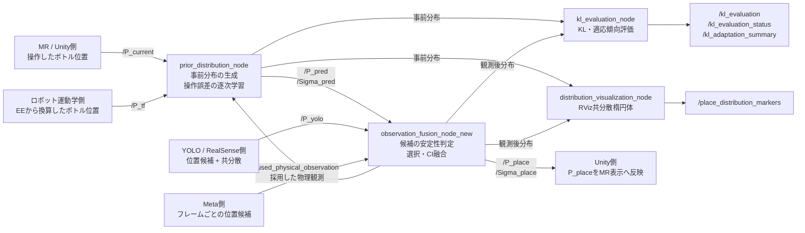
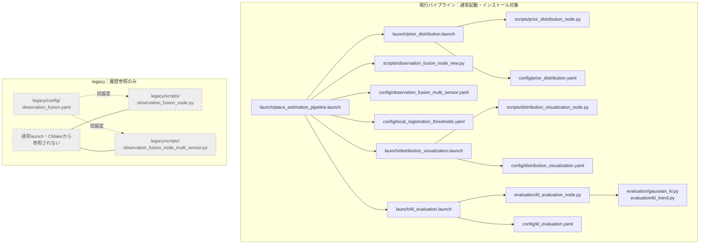
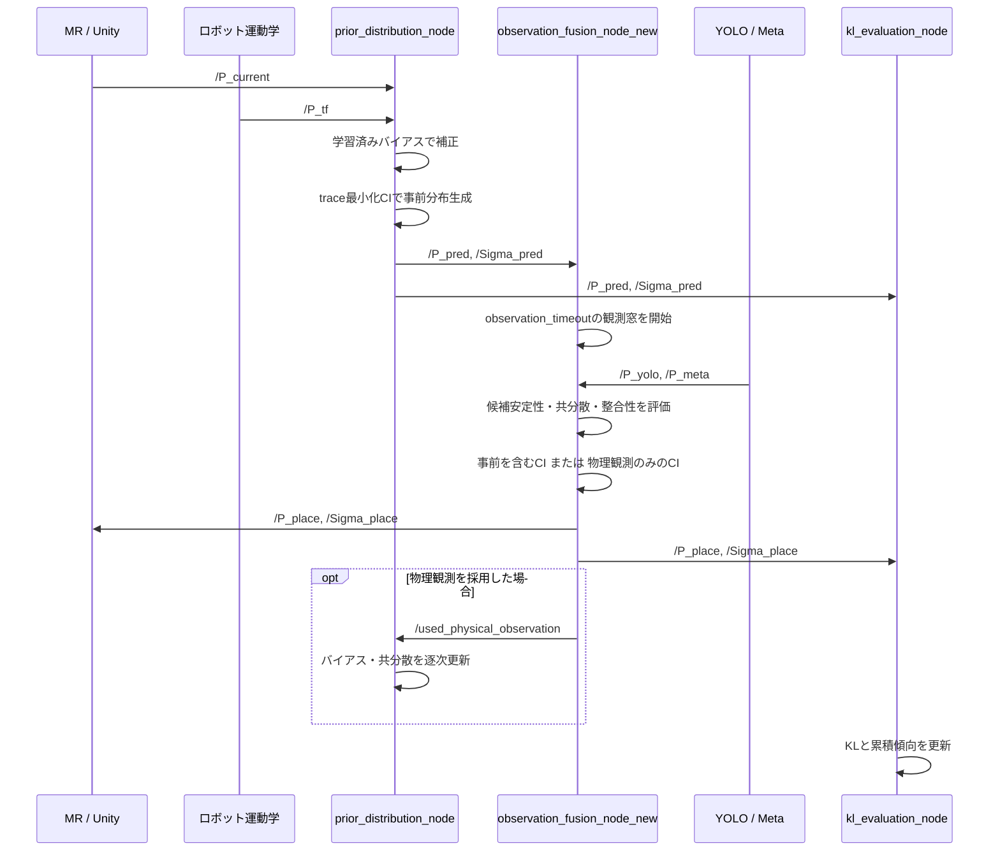
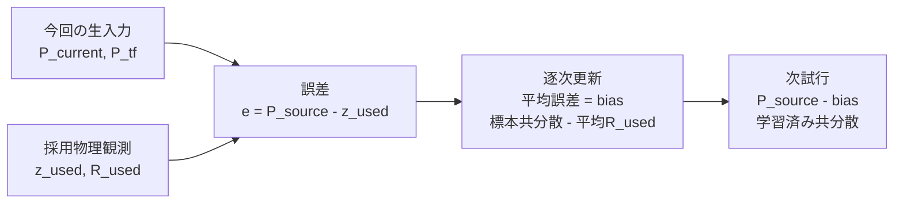
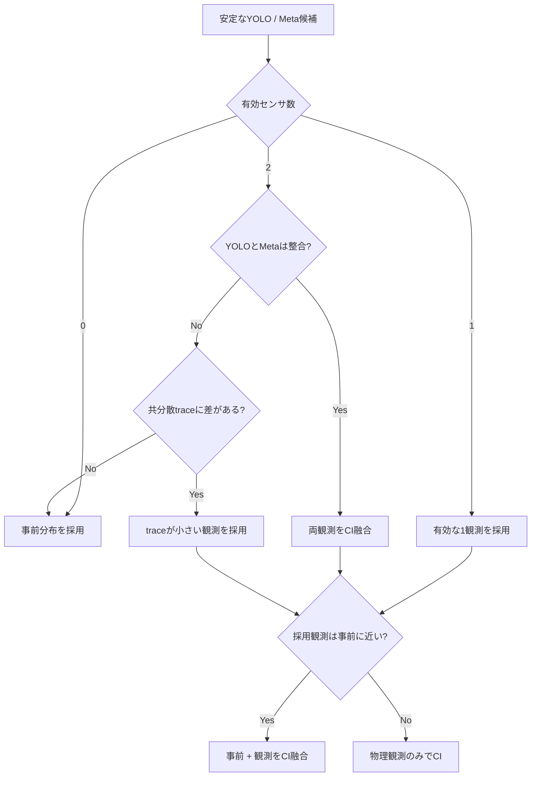

# place_estimation システム構成・設定ガイド

この文書は、局所適応レジストレーションのROSパッケージについて、
「どのノードが何をするか」「どのトピックを参照するか」
「どの設定をどこで変更するか」をまとめたものです。

通常起動は次の1コマンドです。

```bash
roslaunch place_estimation place_estimation_pipeline.launch
```

## 1. システム全体像



重要な責務分担は次のとおりです。

- 上流ROS側は、すべての位置をボトル中心・メートル・`base_footprint`へ
  変換してから本パッケージへ渡します。
- 本パッケージは、事前分布生成、物理観測の選択・融合、逐次学習、
  KL評価を担当します。
- Unity側は、`/P_place`をMR座標へ変換し、対象ボトルの表示を更新します。
- 本パッケージは姿勢、環境全体のSLAM地図、MR表示そのものを更新しません。

入力データの詳細は [data_contract.md](data_contract.md) を参照してください。

## 2. 起動ファイルとConfigの参照関係



通常パイプラインで使用する観測融合実装は、
`scripts/observation_fusion_node_new.py`です。

次のファイルは旧版・比較用として`legacy/`へ分離されています。
通常の`place_estimation_pipeline.launch`からは起動もインストールもされません。

- `legacy/scripts/observation_fusion_node.py`
- `legacy/scripts/observation_fusion_node_multi_sensor.py`
- `legacy/config/observation_fusion.yaml`

## 3. ノード別の役割

| ノード | 実装ファイル | 主な役割 | 主なConfig |
|---|---|---|---|
| `prior_distribution_node` | `scripts/prior_distribution_node.py` | `P_current`と`P_tf`の補正、事前CI、操作誤差学習 | `config/prior_distribution.yaml` |
| `observation_fusion_node_multi_new` | `scripts/observation_fusion_node_new.py` | 候補形成、安定性判定、候補選択、観測後CI | `config/observation_fusion_multi_sensor.yaml`、`config/local_registration_thresholds.yaml` |
| `distribution_visualization_node` | `scripts/distribution_visualization_node.py` | 事前・観測後分布のRVizマーカー生成 | `config/distribution_visualization.yaml` |
| `kl_evaluation_node` | `evaluation/kl_evaluation_node.py` | `KL(事前 || 事後)`と試行間傾向の評価 | `config/kl_evaluation.yaml` |

この表は現行ノードだけを示しています。`legacy/`内の旧版は、通常起動時の
ROSノード構成には含まれません。

## 4. 1試行の処理順序



### operation ID

`prior_distribution_node`は、`P_current`と`P_tf`の組を受信するたびに
operation IDを1増やします。このIDは`P_pred`、`P_place`、
`used_physical_observation`の対応付けとKL評価に使用されます。

## 5. 逐次学習ループ



学習に関する注意事項は次のとおりです。

- 物理観測が採用された試行だけを学習に使用します。
- 観測なし、または競合により事前へ戻った試行では学習しません。
- バイアスは物理観測を1回採用した後から更新します。
- 共分散は`learning_min_samples`以上から更新します。
- 学習値は現在メモリ上にだけ保持され、ノード再起動時に初期化されます。
- `min_variance`は共分散固有値の数値的な下限です。

## 6. 観測選択の分岐



`gate_yolo`と`gate_meta`は、観測を捨てるための閾値ではありません。
事前分布を最終CIへ含めるかどうかを決定します。

## 7. 主なROSトピック

### 入力・中間・最終出力

| トピック | 型 | 発行元 | 購読先 | 内容 |
|---|---|---|---|---|
| `/P_current` | `Float32MultiArray` | MR側 | 事前分布 | `[metadata, x, y, z]` |
| `/P_tf` | `PoseStamped` | ロボット運動学側 | 事前分布 | EEから換算したボトル中心 |
| `/P_pred` | `PoseStamped` | 事前分布 | 融合、可視化、KL | 事前平均位置 |
| `/Sigma_pred` | `Float32MultiArray` | 事前分布 | 融合、可視化、KL | 事前3x3共分散 |
| `/P_yolo` | `Float32MultiArray` | YOLO/RealSense側 | 融合 | 現設定では候補ごとにXYZ＋3x3共分散 |
| `/P_meta` | `Float32MultiArray` | Meta側 | 融合 | 現設定では1メッセージを1フレームとして扱うXYZ候補 |
| `/P_place` | `PoseStamped` | 融合 | Unity、可視化、KL | 最終推定位置。Unityが使用する主出力 |
| `/Sigma_place` | `Float32MultiArray` | 融合 | 可視化、KL | 最終3x3共分散 |
| `/used_physical_observation` | `PoseWithCovarianceStamped` | 融合 | 事前分布 | 学習に使用する、事前を含まない物理観測分布 |

### 融合診断

| トピック | 内容 |
|---|---|
| `/observation_status` | 採用した分岐名 |
| `/observation_distances` | 選択YOLO、選択Meta、YOLO–Meta間の二乗マハラノビス距離 |
| `/yolo_candidate_distances` | YOLO候補ごとの事前との距離 |
| `/yolo_candidate_scores` | YOLO候補ごとの`exp(-d^2/2)` |
| `/yolo_selected_index` | 選択したYOLO候補番号 |
| `/meta_candidate_distances` | Meta候補ごとの事前との距離 |
| `/meta_candidate_scores` | Meta候補ごとの`exp(-d^2/2)` |
| `/meta_selected_index` | 選択したMeta候補番号 |

### KL・適応評価

| トピック | 型 | 内容 |
|---|---|---|
| `/kl_evaluation` | `Float64MultiArray` | 試行ごとの数値配列 |
| `/kl_evaluation_status` | `String` | 項目名付きJSON |
| `/kl_adaptation_summary` | `String` | 全試行履歴に対する最新の傾向サマリ。ラッチ配信 |

`/kl_evaluation`の配列は次の順序です。

```text
[0] operation ID
[1] KL(prior || posterior)    論文の主指標
[2] KL(posterior || prior)    診断用
[3] symmetric KL
[4] mean shift [m]
[5] prior→posteriorの平均位置成分
[6] prior→posteriorの共分散成分
[7] 主指標の累積平均
[8] 主指標の標本標準偏差
[9] 主指標のEMA
```

試行数の上限や終了回数は設定しません。人が実験を終了した時点で、
最後に記録された`/kl_adaptation_summary`を最終評価として扱います。
`trend_min_samples`は実験の終了回数ではなく、傾向を判定するための
最低サンプル数です。

## 8. どこで何を設定するか

### 8.1 事前分布・逐次学習

設定ファイル：`config/prior_distribution.yaml`

| 変更したい内容 | パラメータ |
|---|---|
| 学習の有効／無効 | `enable_error_learning` |
| 共分散学習開始までの最低採用数 | `learning_min_samples` |
| 初期バイアス | `bias_current`、`bias_tf` |
| 初期標準偏差 | `sigma_current`、`sigma_tf` |
| 完全な3x3初期共分散 | `covariance_current`、`covariance_tf` |
| 事前CIの重み決定 | `ci_weight_mode` |
| CI探索刻み | `ci_weight_step` |
| CI目的関数 | `ci_objective` |
| 共分散固有値の下限 | `min_variance` |

通常設定では`ci_weight_mode: optimize`、`ci_objective: trace`です。

### 8.2 センサ入力形式・固定センサ誤差・観測CI

設定ファイル：`config/observation_fusion_multi_sensor.yaml`

| 変更したい内容 | パラメータ |
|---|---|
| YOLOを使用するか | `enable_yolo` |
| YOLOのpacked／stream | `yolo_input_mode` |
| YOLOレコード構造 | `yolo_candidate_stride`、`yolo_xyz_indices`、`yolo_covariance_indices` |
| Metaのメッセージ型 | `meta_message_type` |
| Metaのpacked／stream | `meta_input_mode` |
| Metaレコード構造 | `meta_candidate_stride`、`meta_xyz_indices`、`meta_covariance_indices` |
| 最大候補数 | `max_yolo_candidates`、`max_meta_candidates` |
| 固定センサバイアス | `bias_yolo`、`bias_meta` |
| 固定センサ標準偏差 | `sigma_yolo`、`sigma_meta` |
| 観測後CIの方式 | `observation_ci_weight_mode` |
| CI探索刻み・目的関数 | `observation_ci_weight_step`、`observation_ci_objective` |

現在はYOLOが`packed`かつ共分散付き、MetaがXYZの`stream`です。

### 8.3 実験で決定する閾値

設定ファイル：`config/local_registration_thresholds.yaml`

| 変更したい内容 | パラメータ |
|---|---|
| 観測共分散の最大主軸標準偏差 | `max_std_yolo`、`max_std_meta` |
| 事前をCIに含める距離 | `gate_yolo`、`gate_meta` |
| YOLO–Meta整合閾値 | `gate_yolo_meta` |
| 競合時に不確かさを同等とみなす範囲 | `uncertainty_trace_relative_tolerance`、`uncertainty_trace_absolute_tolerance` |
| 観測窓の長さ | `observation_timeout` |
| 安定候補に必要な最低フレーム数 | `min_observation_frames` |
| 最低検出継続率 | `min_detection_ratio` |
| フレーム間ばらつき上限 | `max_frame_position_std_yolo`、`max_frame_position_std_meta` |
| フレーム間の候補対応距離 | `candidate_association_distance` |

このファイルの値は現在すべて暫定値です。実験で変更する場合は、
ノードのPythonコードではなく、このファイルを編集します。

### 8.4 KL・傾向評価

設定ファイル：`config/kl_evaluation.yaml`

| 変更したい内容 | パラメータ |
|---|---|
| EMAの追従性 | `ema_alpha` |
| 未対応データの最大保持数 | `max_pending_operations` |
| 初期／直近比較の窓幅 | `trend_window_size` |
| 傾向判定に必要な最低試行数 | `trend_min_samples` |
| 改善・悪化とみなす相対変化 | `relative_change_threshold` |
| 増加・減少・横ばいの傾き判定 | `normalized_slope_threshold` |

### 8.5 RViz表示

設定ファイル：`config/distribution_visualization.yaml`

| 変更したい内容 | パラメータ |
|---|---|
| 共分散楕円体のシグマ倍率 | `sigma_scale` |
| 最小表示軸長 | `min_axis` |
| マーカー寿命 | `marker_lifetime` |
| 事前分布の色 | `prior_color` |
| 観測後分布の色 | `posterior_color` |

## 9. ファイル構成

```text
place_estimation/
├── launch/
│   ├── place_estimation_pipeline.launch      # 通常の全体起動
│   ├── prior_distribution.launch             # 事前分布ノード
│   ├── distribution_visualization.launch     # RVizマーカー
│   └── kl_evaluation.launch                   # KL評価ノード
├── config/
│   ├── prior_distribution.yaml               # 事前CI・逐次学習
│   ├── observation_fusion_multi_sensor.yaml   # センサ入力・観測CI
│   ├── local_registration_thresholds.yaml     # 実験調整用閾値
│   ├── distribution_visualization.yaml        # RViz表示
│   └── kl_evaluation.yaml                     # KL・傾向判定
├── scripts/
│   ├── prior_distribution_node.py             # 事前分布・学習
│   ├── observation_fusion_node_new.py          # 現行の観測融合
│   └── distribution_visualization_node.py      # RViz表示
├── evaluation/
│   ├── kl_evaluation_node.py                  # ROS KL評価
│   ├── gaussian_kl.py                         # ガウス分布間KL
│   ├── kl_trend.py                            # 試行間傾向判定
│   └── README.md                              # KL出力仕様
├── legacy/
│   ├── README.md                              # 旧版の扱い
│   ├── config/
│   │   └── observation_fusion.yaml            # 旧設定
│   └── scripts/
│       ├── observation_fusion_node.py          # 初期融合版
│       └── observation_fusion_node_multi_sensor.py # 旧複数センサ版
├── docs/
│   ├── system_architecture.md                 # この文書
│   └── data_contract.md                       # 入出力データ仕様
└── tests/
    ├── test_observation_fusion_stability.py   # 融合分岐・安定性
    ├── test_prior_error_learning.py           # 逐次学習
    ├── test_gaussian_kl.py                    # KL数式
    ├── test_kl_trend.py                       # 傾向判定
    └── ros_pipeline_smoke_test.py             # ROS結合テスト
```

## 10. 実行・確認コマンド

### 全体起動

```bash
roslaunch place_estimation place_estimation_pipeline.launch
```

### Unity向けの最終位置

```bash
rostopic echo /P_place
```

### 融合分岐

```bash
rostopic echo /observation_status
```

### 試行ごとのKL

```bash
rostopic echo /kl_evaluation_status
```

### 最新の累積傾向

```bash
rostopic echo -n 1 /kl_adaptation_summary
```

### 実験記録

```bash
rosbag record -O local_registration_eval.bag \
  /P_current /P_tf \
  /P_pred /Sigma_pred \
  /P_yolo /P_meta \
  /P_place /Sigma_place \
  /observation_status /observation_distances \
  /used_physical_observation \
  /kl_evaluation /kl_evaluation_status /kl_adaptation_summary
```

## 11. 現在の注意点

- Config内の共分散、ゲート、安定性閾値は実験前の暫定値です。
- 特に`min_variance: 1.0e-8`と`learning_min_samples: 2`は、
  実験結果に基づいて再設定する必要があります。
- 学習状態はROSノードを終了すると失われます。
- KLの低下は事前分布と観測後分布が近づいたことを表しますが、
  独立した真値に対する精度向上を直接証明するものではありません。
- 真値を測定できない実験では、タスク成功率に加えて、NASA-TLX、
  タスク時間、修正操作回数などを評価対象とします。
- `legacy/`は参照用です。現行コードへ戻す場合は、launch、Config、
  CMakeの依存関係を確認してから明示的に復元してください。
